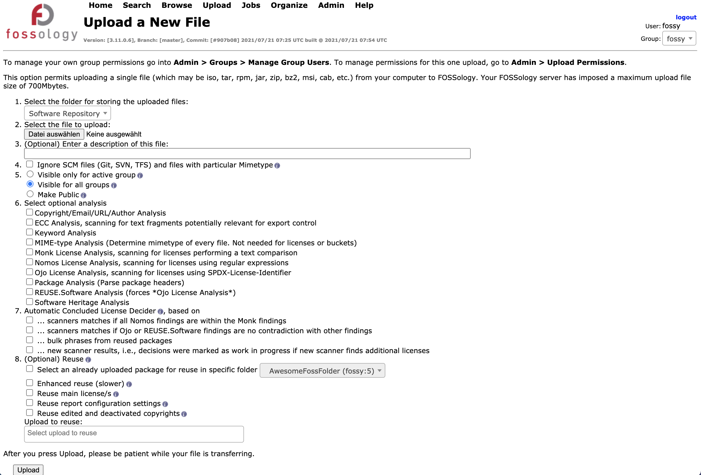

===============
Sample Workflow
===============

 A small code sample :
    - create token (if necessary)
    - login on Fossology (using the token)
    - create a "clearing" group
    - upload a source file (visible for the group)
    - start default scan jobs
    - generate report
    - download report
    - store report in local file

Needed imports and Variables
============================

.. code-block:: python

    import sys
    import pathlib 
    import secrets
    from getpass import getpass
    import requests
    from fossology import Fossology, fossology_token
    from fossology.obj import Group, AccessLevel, TokenScope

    FOSSOLOGY_SERVER = "http://fossology/repo"

Create JWT Token
================

Create token - if not already done - and store it in local file for reuse.

.. code-block:: python

  path_to_token_file = pathlib.Path.cwd() / '.token'
  if not path_to_token_file.exists():
    print("Enter your Fossology credentials, e.g. in the test environment 'username: fossy' and 'password: fossy'")
    username = input("username: ")
    pw = getpass()
    token = fossology_token(
        FOSSOLOGY_SERVER,
        username,
        pw,
        secrets.token_urlsafe(8), # TOKEN_NAME seen in the database
        TokenScope.WRITE,
    )
    with open(path_to_token_file, "w") as fp:
        fp.write(token)
    print("token written to .token")
  else:
    print("Reuse token from .token")
    # Load the token
    with open(".token", "r") as fp:
        token = fp.read()

Login to the Fossology Server
=============================

 Create the Fossology Instance.

.. code-block:: python

  foss = Fossology(FOSSOLOGY_SERVER, token)
  print(f"Logged in as user {foss.user.name}")

Create Folder If needed 
=======================

Create Folder if needed.

.. code-block:: python

  folder_name = "AwesomeFossFolder"
  folder_desc = "AwesomeProjectSources"
  test_folder = foss.create_folder(
        foss.rootFolder, folder_name, description=folder_desc
    )
  print(f"Created {test_folder.name} with description {test_folder.description}")

Create Group If needed 
=======================

Create Group If needed.

.. code-block:: python

  group_name = "clearing"
  group_already_created = False

  for group in foss.list_groups():
    if group.name == group_name:
      group_already_created = True
      print(f"Group {group_name} already created")
      test_group = group

  if not group_already_created:
    foss.create_group(group_name)
    # The name of the group created by `create_group` can be used in subsequent
    # call to restrict access to resources from this group, see 
    # https://fossology.github.io/fossology-python/groups.html for further resources
    for group in foss.list_groups():
      if group.name == group_name:
        test_group = group
    print(f"Created group named {test_group.name}")

Upload File 
===========
We first get an example file from our github repository testenvironment and then
upload it to the server. 

.. code-block:: python

   filename = "my_base-files_11.tar.xz"
   path_to_upload_file = pathlib.Path.cwd() / filename
   if not path_to_upload_file.exists():
     url = "https://github.com/fossology/fossology-python/blob/master/tests/files/base-files_11.tar.xz"
     print(f"Get a local copy of {filename} from {url}")
     r = requests.get(url)
     with open(path_to_upload_file, "wb") as fp: 
       fp.write(r.content)

   my_upload = foss.upload_file(
     test_folder,
     file=path_to_upload_file,
     description="Test upload via fossology-python lib",
     group=test_group.name,
     access_level=AccessLevel.PUBLIC,
   )   

Start default scan jobs
=======================

After uploading a source code archive a scan job could be triggered to analyze
the archive.  There are different agents available to scan/analyze for license relevant
text/Copyrights/Export Control and Customs (ECC)/... .
Furthermore multiple possibilities for decisions or reusing components are available.

The doings of this step are best explained showing the corresponding web interface on the Fossology Server. 

The below given job_specification resemble the buttons activated in the web-ui.

.. code-block:: python

  job_specification = {
        "analysis": {
            "bucket": True,
            "copyright_email_author": True,
            "ecc": True,
            "keyword": True,
            "monk": True,
            "mime": True,
            "monk": True,
            "nomos": True,
            "ojo": True,
            "package": True,
            "specific_agent": True,
        },
        "decider": {
            "nomos_monk": True,
            "bulk_reused": True,
            "new_scanner": True,
            "ojo_decider": True,
        },
        "reuse": {
            "reuse_upload": 0,
            "reuse_group": 0,
            "reuse_main": True,
            "reuse_enhanced": True,
            "reuse_report": True,
            "reuse_copyright": True,
        },
    }

  detailed_job = foss.schedule_jobs(
    test_folder,
    my_upload,
    job_specification
  )

  print(f"scan job {detailed_job} set up")

Generate report
===============

Generate a  report based on the uploaded archive  and the findings 
of the analysis - download the report and store it on disk.

.. code-block:: python

  report_id = foss.generate_report(my_upload, group=test_group.name)
  print(f"report created with id {report_id} ")
  content, name = foss.download_report(report_id, test_group.name)
  print(f"report downloaded with name {name}")
  with open(name, "wb") as fp:
    fp.write(content)
  print(f"report was written to file {name}.")

